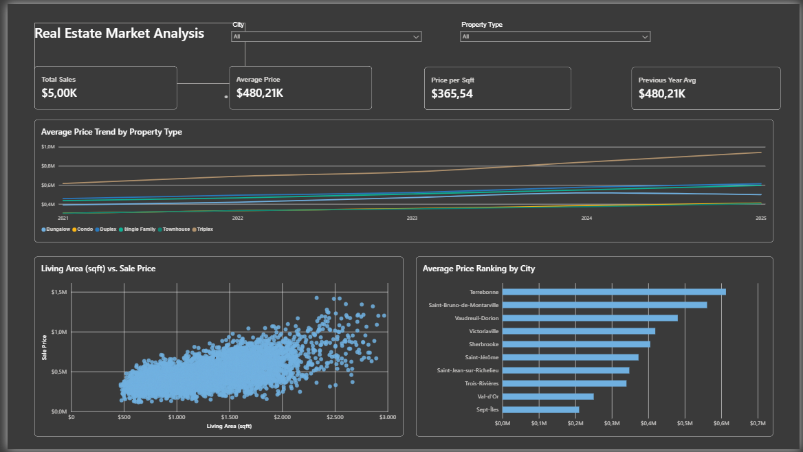

# 🏢 Real Estate Market Analysis - Quebec

An interactive Power BI dashboard developed to analyze housing sales trends, property prices, and regional performance across Quebec.

## 📊 Dashboard Overview
The dashboard provides key insights into the real estate market, featuring dynamic KPIs, multi-property trend tracking, and geographic pricing distributions.

 <!-- Substitua pelo nome exato do arquivo de imagem que você subiu -->

## 🚀 Key Features & KPIs
* **Total Sales:** Overview of total transactions recorded in the dataset ($5.00K).
* **Average Price:** Market benchmark tracking property values over time ($480.21K).
* **Price per Sqft:** Unit economic metric evaluating property efficiency ($365.54).
* **Trend Analysis:** Multi-line chart illustrating average price evolution by property type (Bungalow, Condo, Duplex, Single Family, Townhouse, Triplex) from 2021 to 2025.
* **Correlation Analysis:** Scatter plot mapping living area against sale prices.
* **Geographic Ranking:** Bar chart ranking cities by their average property prices.

## 🛠️ Tools & Skills Applied
* **Power BI Desktop:** Data modeling, relationships setup, DAX measures, and UI/UX layout design.
* **Data Transformation:** Cleaning and structuring raw housing data.
* **Data Visualization:** Executive design standards, custom color themes, and international currency formatting (USD).

## 📂 Files Included
* `Quebec_Housing_Sales.pbix`: The complete Power BI project file.
* `dashboard_preview.png`: Visual preview of the final report.
